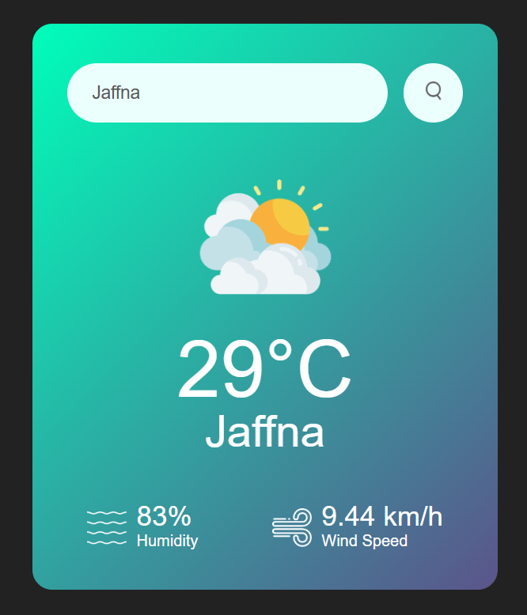

# 🌤️ Weather App
A simple, stylish Weather App built using **HTML**, **CSS**, and **JavaScript** that fetches real-time weather data using the [OpenWeatherMap API](https://openweathermap.org/api).

## 🔧 Features
- 🔍 Search weather by **city name**
- 🌡️ Display current **temperature**, **humidity**, and **wind speed**
- ⛅ Dynamically update **weather icons** based on weather conditions
- ❌ Show error message for invalid city names
- 📱 Responsive and clean UI design

## 🚀 Technologies Used
- HTML5
- CSS3
- JavaScript (ES6)
- [OpenWeatherMap API](https://openweathermap.org/api)

## 📌 How to Use
1. Clone the repository:
git clone https://github.com/your-username/weather-app.git
cd weather-app
2. Open index.html in your browser or launch via VS Code Live Server.
3. Enter a city name and hit the search button to get the weather info.

## 🔐 API Key
Replace the value of apiKey in script.js with your own key from OpenWeatherMap.
const apiKey = "your_api_key_here";

## 👨‍💻 Author
Sivanathan Dilakshan
